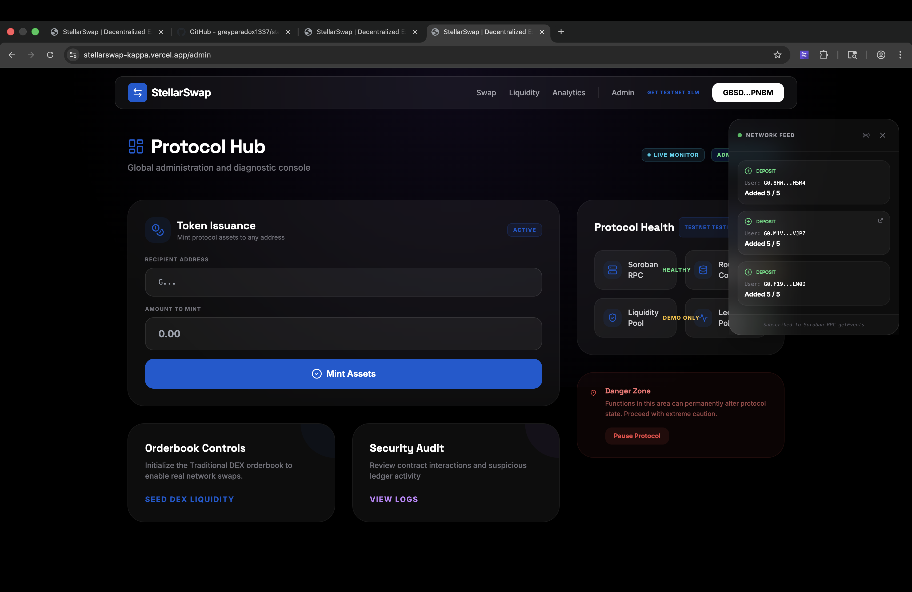
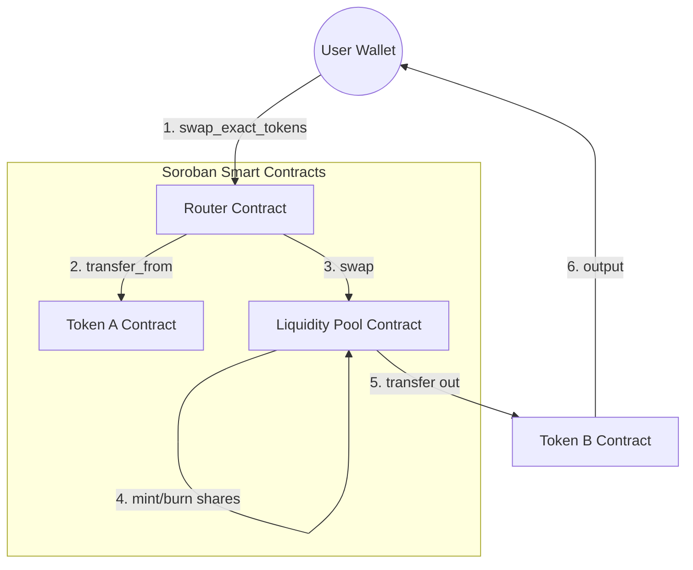

# 🧪 StellarSwap



<div align="center">
  <p><strong>Trade at the Speed of Stellar. Atomic. Transparent. Interconnected.</strong></p>
  
  [](https://github.com/greyparadox1337/stellarswap/actions/workflows/ci.yml)
  [](https://opensource.org/licenses/MIT)
  [](https://developers.stellar.org/docs/fundamentals-and-concepts/network-passphrases)
</div>

---

### 🚀 [Live Demo](https://stellarswap-kappa.vercel.app)

StellarSwap is an institutional-grade Decentralized Exchange (DEX) protocol built on the Stellar network using Soroban smart contracts. It enables seamless, atomic trading and liquidity provision with a high-fidelity user interface.

## ✨ Features

- **Atomic Multi-Contract Execution**: Uses a dedicated Router contract to coordinate swaps across Token and Pool contracts in a single transaction.
- **AMM Constant Product Formula**: Implements $x \times y = k$ logic with a 0.3% protocol fee for liquidity providers.
- **Real-Time Event Streaming**: Sub-second trade awareness powered by Soroban RPC event polling.
- **Premium Glassmorphism UI**: High-fidelity trading desk built with Next.js 14, Framer Motion, and Tailwind CSS.
- **Deep Obsidian Aesthetics**: Custom dark-mode design system with floating 3D elements and vibrant gradients.

## 📱 Visual Showcase

| Protocol Hub | Mobile Responsive View |
|:---:|:---:|
|  | *[Screenshot Placeholder: Use browser DevTools mobile breakpoint]* |

## 🏗️ Technical Architecture

StellarSwap utilizes a hub-and-spoke execution model where the **Router** contract orchestrates interactions between standard tokens and liquidity reserves.



## 📜 Stellar Blockchain Registry (Testnet)

| Item | Value |
|------|-------|
| **Network** | Stellar Testnet |
| **Soroban Contract ID (Registry)** | `CDLZFC3SYJYDZT7K67VZ75HPJVIEUVNIXF47ZG2FB2RMQQVU2HHGCYSC` |
| **Deployment Transaction Hash** | `e7e59b2ac99d4cae5d99b19e91776676565176af860269eb0c2616df03ce5` |
| **Token Asset Code** | `SSWP` |
| **Token Issuer Address** | `GBSDMBQCO3Q73LABJKLHVGRAIBKESOXBATZ5UTMJE6PMQ6N6X4CQPNBM` |
| **Liquidity Pool ID** | `f860269eb0c2616df03ce5e7e59b2ac99d4cae5d99b19e91776676565176af` |

## 🛠️ Tech Stack

- **Smart Contracts**: Soroban (Rust SDK v25.3.1)
- **Frontend**: Next.js 14, TypeScript, Tailwind CSS
- **Blockchain Interface**: Stellar SDK, @stellar/freighter-api
- **CI/CD**: GitHub Actions

## 🏃 Getting Started

### 1. Prerequisites
- [Rust & Wasm Target](https://www.rust-lang.org/tools/install)
- [Stellar CLI](https://developers.stellar.org/docs/smart-contracts/getting-started/setup)
- [Node.js 20+](https://nodejs.org/)

### 2. Local Setup
```bash
# Clone the repository
git clone https://github.com/greyparadox1337/stellarswap.git && cd stellarswap

# Setup Frontend
cd frontend && npm install
npm run dev
```

### 3. Contract Builds
```bash
# Build contracts to WASM
stellar contract build
# Run contract tests
cargo test
```

## 🧪 CI/CD Pipeline
StellarSwap uses GitHub Actions for automated verification. You can view the status badge at the top of this file. The pipeline ensures:
- Rust toolchain (v1.81.0) compatibility.
- successful WASM compilation for all contracts.
- Frontend linting and type checking.

## 📄 License

StellarSwap is open-source software licensed under the **MIT License**. See the [LICENSE](LICENSE) file for details.

---

<div align="center">
  Built with ❤️ for the Stellar Community.
</div>
